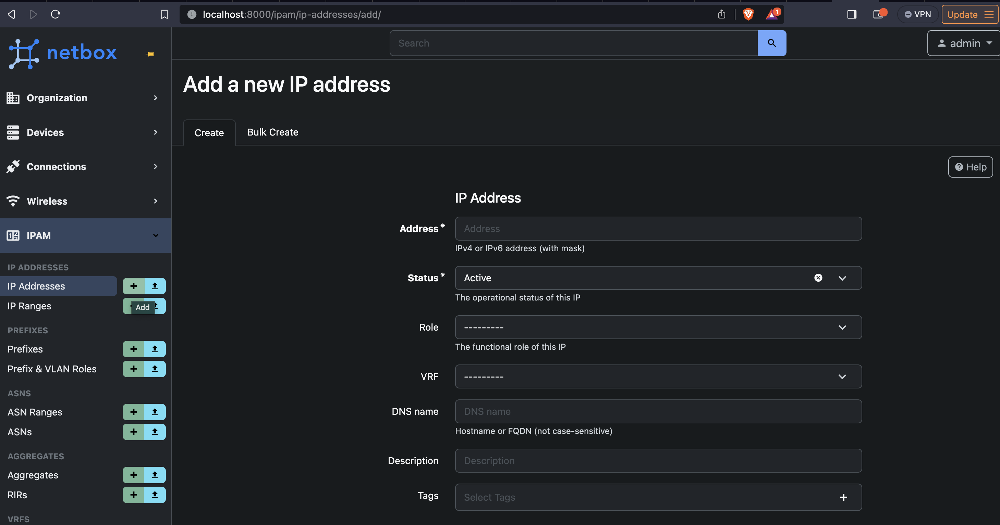
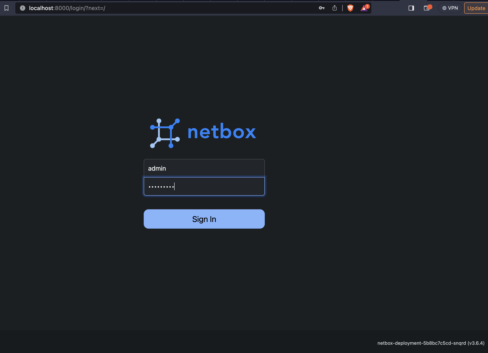
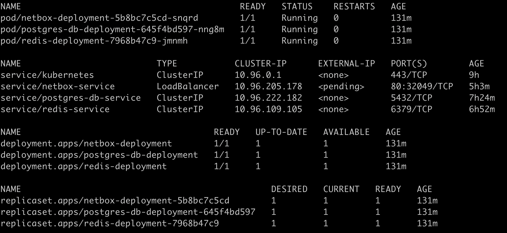

### Overly simplified Netbox installation in a K8s cluster
- Helps with local testing
- Iterative development



```
Generate K8s secret: 
python3 generate_k8s_secret.py
```



Docker Build: `docker build . -t sivaramsajeev/netbox-for-k8s && docker push sivaramsajeev/netbox-for-k8s`

In case of local KIND cluster: `kind load docker-image --name netbox-demo sivaramsajeev/netbox-for-k8s`

```
for f in `grep -l apiVersion * | grep "yaml$"`;do kubectl apply -f $f;done

kubectl port-forward service/netbox-service 8000:80
```




